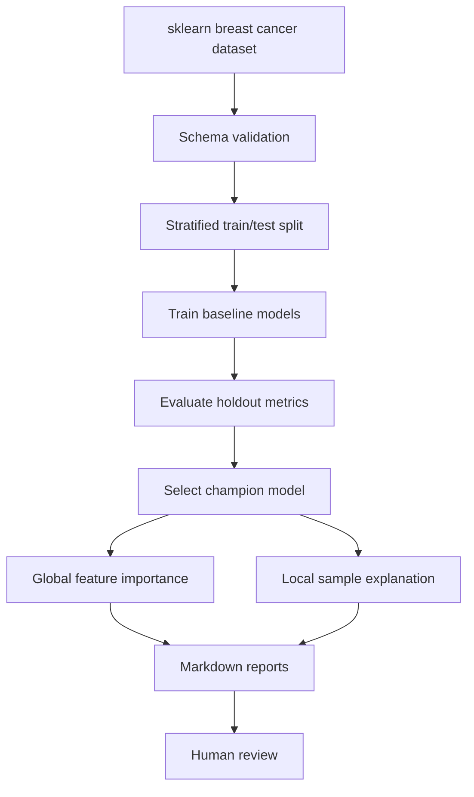

# Architecture

This repository implements an explainable medical AI engineering workflow for reproducible model benchmarking, feature attribution, and markdown reporting. It is intended for research and engineering demonstration with human-in-the-loop review.

It does not provide diagnosis, treatment instructions, or autonomous clinical recommendations.

## Package Layout

```text
src/medical_ai_explainability/
├── data.py            # dataset loading and train/test splitting
├── schema.py          # tabular schema validation
├── features.py        # preprocessing components
├── models.py          # baseline model training and champion selection
├── evaluation.py      # metric calculation
├── explainability.py  # global and local feature attribution
├── reporting.py       # markdown report rendering
└── cli.py             # reproducible command-line workflow
```

## Workflow



## Safety Boundary

The workflow demonstrates engineering practices for operational AI review:

- reproducible data loading and validation
- deterministic model training
- transparent metric reporting
- feature attribution for inspection
- explicit human-review language in generated reports

The generated artifacts must not be interpreted as clinical decisions.
